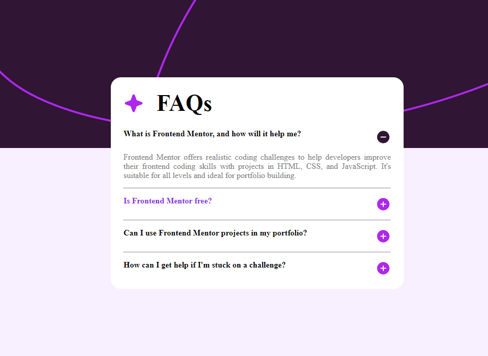
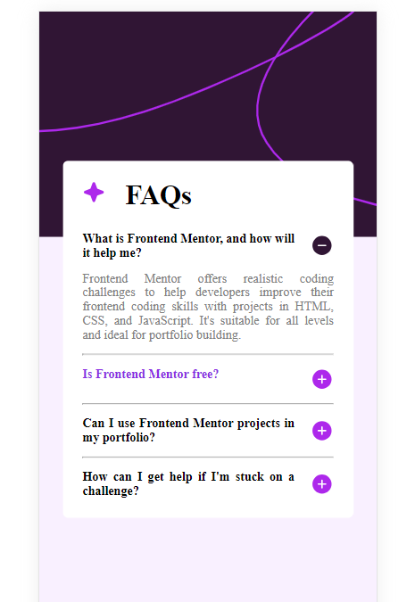

## Table of contents

- [Overview](#overview)
  - [The challenge](#the-challenge)
  - [Screenshot](#screenshot)
- [My process](#my-process)
  - [Built with](#built-with)
  - [What I learned](#what-i-learned)
  - [Continued development](#continued-development)
- [Author](#author)

## Overview

Este é um desafio feito pelo App FrontEndMentor para ajudar novos e antigos desenvolvedores a progredirem em suas habilidades de programação, raciocinio e visual. Capacitando-os a trabalhar diretamente com o estilo exigido pelo mercado de trabalho.

This is a challenge made by App FrontEndMentor to help new and old developers progress in their programming, reasoning and visual skills. Enabling them to work directly with the style required by the job market.

### The challenge

Users should be able to:

- Hide/Show the answer to a question when the question is clicked
- View the optimal layout for the interface depending on their device's screen size
- See hover and focus states for all interactive elements on the page

### Screenshot

Desktop

Mobile

## My process

### Built with

- Semantic HTML5 markup
- CSS custom properties
- Flexbox
- CSS Grid
- Mobile-first workflow
- JavaScript library

### What I learned

Aprendi a utilizar Display Grid e Display flex um pouco mais. Aprendi a controlar um pouco mais os elementos pais e filhos do CSS como o casamento de padding, heigth e margins de forma mais adequada. Aprendi a olhar a imagens e distinguir os elementos de sua criação. Aprendi a utilizar JavaScript um pouco melhor, na prática.

I've learned to use Display Grid and Display flex a little more. I learned to control CSS parent and child elements a little more, such as matching padding, height and margins more appropriately. I learned to look at images and distinguish the elements of their creation. I learned to use JavaScript a little better, in practice.

### Continued development

Continuarei a desenvolver em futuros projetos os dados aprendidos acima. Para fixa-los em minha mente e torna-los naturais.

I will continue to develop the data learned above in future projects. To fix them in my mind and make them natural.

## Author

- LinkedLin - tiago-pereira-n (https://www.linkedin.com/in/tiago-pereira-n/)
- Frontend Mentor - [@TigoP](https://www.frontendmentor.io/profile/TigoP)
